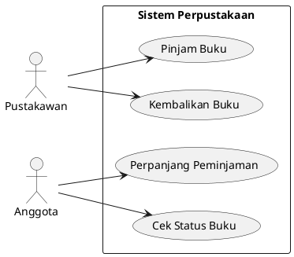
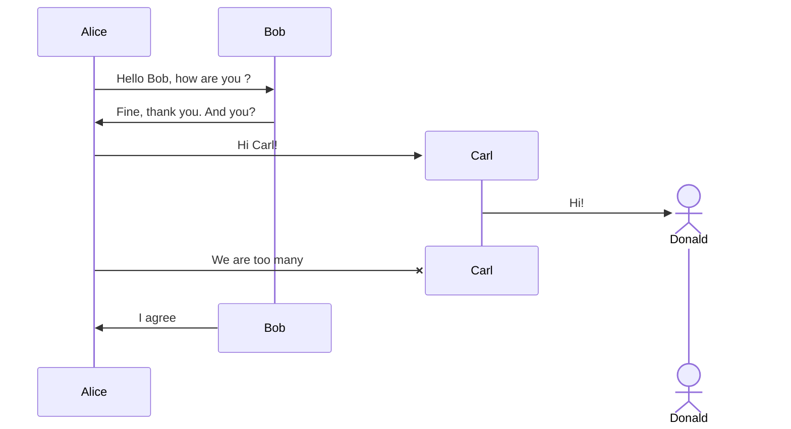
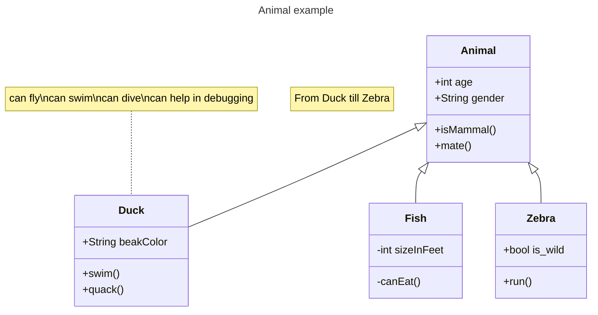
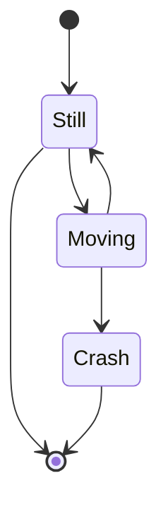
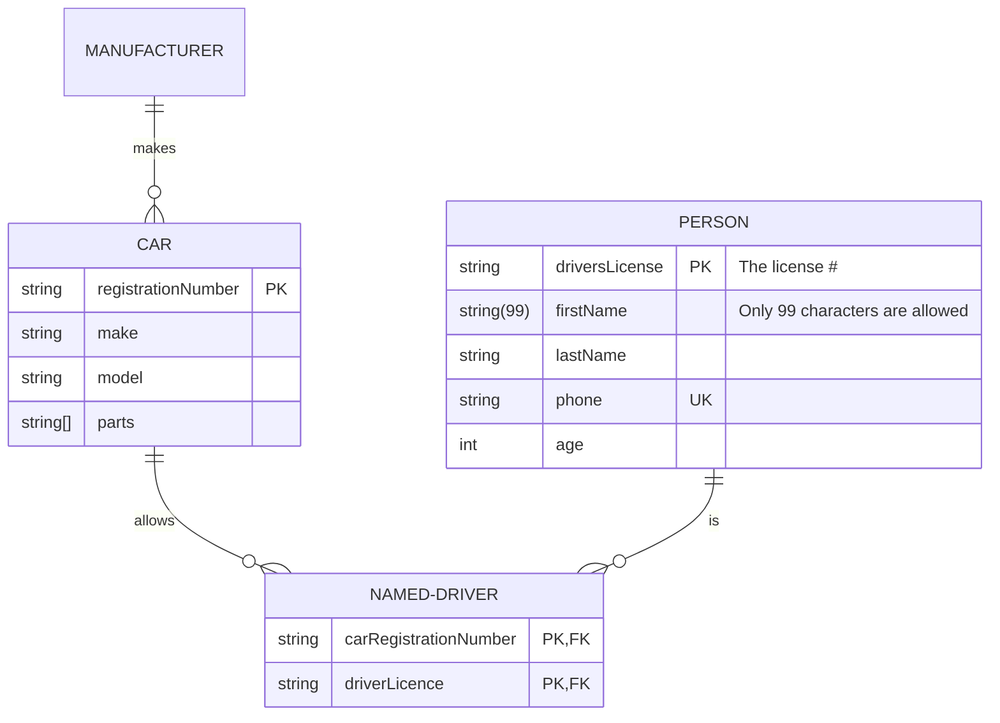
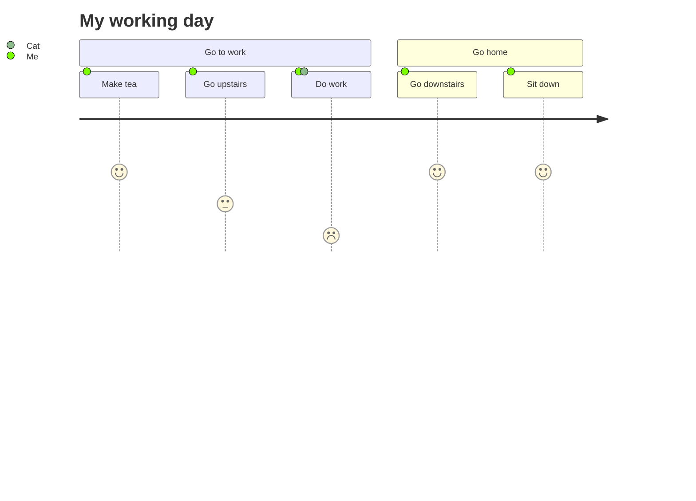

# Penulisan Dokumentasi Project

## Judul

Ini adalah nama dari projectnya. Ini menggambarkan keseluruhan proyek dalam satu kalimat, dan membantu orang memahami apa tujuan dan sasaran utama proyek tersebut.

## Deskripsi

Deskripsi adalah bagian yang memberikan gambaran umum tentang proyek yang sedang dikembangkan. Tujuannya adalah untuk menjelaskan apa tujuan proyek, apa masalah yang dipecahkan oleh proyek, dan mengapa proyek ini penting atau berguna.

Ini adalah bagian penting dari suatu proyek, dan banyak pengembang dan non-pengembang akan melihatnya. Sangat penting untuk memiliki informasi yang paling akurat dan benar. Deskripsi perlu ditulis dengan baik tanpa kesalahan tata bahasa dan dapat dibaca oleh pengguna dari berbagai latar belakang. Deskripsi tidak perlu panjang tetapi perlu merangkum keseluruhan proyek. Misalnya, apa yang dilakukan pada aplikasi ini? Teknologi apa saja yang gunakan? dan lain lain.

## Version History

Version history menggunakan Semantic Versioning (SemVer). SemVer berbentuk Major.Minor.Patch


Semantic Versioning merupakan bilangan 3 komponen dalam format X.Y.Z, dimana :
- X adalah singkatan dari versi Major. Angka paling kiri menunjukkan versi mayor. Saat Anda menambah nomor versi mayor, Anda menambahnya satu tetapi Anda menyetel ulang versi patch dan versi minor ke nol. Jika versi saat ini adalah 2.6.9 maka upgrade berikutnya untuk versi mayor adalah 3.0.0. Tingkatkan nilai X ketika
- Y adalah singkatan dari versi Minor. Ini digunakan untuk merilis fungsionalitas baru dalam sistem. Ketika Anda meningkatkan versi minor, Anda menambahnya satu tetapi Anda harus mengatur ulang versi patch ke nol. Jika versi saat ini adalah 2.6.9 maka upgrade berikutnya untuk versi minor adalah 2.7.0. Tingkatkan nilai Y ketika mengimplementasikan fitur baru yang kompatibel dengan versi sebelumnya.
- Z adalah singkatan dari Versi Patch: Versi patch digunakan untuk perbaikan bug. Tidak ada perubahan fungsionalitas pada peningkatan versi patch. Jika versi saat ini adalah 2.6.9 maka versi berikutnya untuk peningkatan patch adalah 2.6.10. Tidak ada batasan untuk angka-angka ini. Tingkatkan nilai Z saat memperbaiki bug


### Catatan

- Versi pertama dimulai pada 0.1.0 dan bukan pada 0.0.1, karena tidak ada perbaikan bug yang dilakukan, kami memulai dengan serangkaian fitur sebagai draf pertama proyek.
- Sebelum 1.0.0 hanyalah Fase Pengembangan, di mana Anda fokus menyelesaikan sesuatu. Tahap ini diperuntukkan bagi pengembang dimana sistem sedang dikembangkan.
- SemVer tidak mencakup perpustakaan yang diberi tag 0. * . *. Versi stabil pertama adalah 1.0.0.2

## High Level Arsitektur
HLA merupakan standar kerangka kerja yang memungkinkan berbagai simulasi berbasis komputer beroperasi dan berinteraksi dalam sebuah lingkungan terdistribusi. Tujuannya adalah memudahkan integrasi dan komunikasi di antara sistem simulasi yang beragam. Standar ini sangat relevan dan digunakan di sektor-sektor seperti militer, kedirgantaraan, hiburan, dan penelitian. Dengan HLA, sistem-sistem simulasi dapat berbagi data dan informasi dengan cara yang konsisten dan akurat, menjamin hasil simulasi yang handal.


### Kenapa High Level Arsitektur dicantumkan?
Menyertakan High Level Architecture (HLA) dalam file `Readme.md` di sebuah repository memberikan berbagai keuntungan, antara lain:

1. **Pemahaman Mendalam**: HLA menawarkan gambaran singkat mengenai cara kerja sistem, memudahkan bagi siapapun yang ingin memahami proyek dengan cepat.

2. **Dokumentasi Visual**: Sebagai bentuk dokumentasi yang intuitif, HLA dapat menggambarkan ide-ide kompleks dengan cara yang lebih mudah dicerna dibandingkan dengan penjelasan berbasis teks saja.

3. **Meningkatkan Kolaborasi**: Dengan memahami kerangka kerja tingkat tinggi, kontributor baru dapat lebih cepat mengetahui bagaimana mereka dapat berkontribusi. Hal ini mendukung kerjasama tim dan integrasi kontribusi dengan lebih efisien.

4. **Sebagai Panduan**: HLA bertindak sebagai referensi saat menambahkan atau mengubah fitur, memastikan bahwa perubahan tetap konsisten dengan visi arsitektural awal.


### Cara memanfaatkan :

Untuk memanfaatkan High Level Architecture (HLA), berikut langkah-langkah yang direkomendasikan:

1. **Definisikan Tujuan**: Mulailah dengan memahami tujuan dari sistem yang hendak Anda kembangkan. Mengenali tujuan akan memandu Anda dalam menentukan fitur-fitur esensial yang diperlukan.

2. **Kenali Komponen Utama**: Tentukan komponen-komponen krusial dari sistem, entah itu berupa modul, subsistem, atau bagian lain yang memiliki fungsinya masing-masing.

3. **Susun Desain**: Buatlah desain arsitektural tingkat tinggi untuk sistem. Ini meliputi deskripsi keseluruhan arsitektur, desain basis data, ringkasan sistem, layanan yang ditawarkan, platform yang digunakan, serta relasi antar modul.

4. **Evaluasi Desain**: Setelah mendesain, pastikan untuk mengevaluasi agar seluruh komponen tersentuh dan relasi antar-komponen telah tepat.

5. **Lakukan Implementasi**: Terapkan desain tingkat tinggi ke dalam kode program. Selama tahap ini, Anda mungkin memerlukan beberapa modifikasi pada desain untuk mengoptimalkan kinerja sistem.


**Referensi**:
- [Perbedaan High Level Design dan Low Level Design - Glints](https://glints.com/id/lowongan/high-level-low-level-design/)
- [Software Architecture by Rizal](https://medium.com/sulang/software-architecture-60861fdf6f49)
- [Hierarchy Control System - Dinamika](https://repository.dinamika.ac.id/id/eprint/1424/5/BAB_III.pdf)
- [Arsitektur High Tech - 99.co](https://www.99.co/id/panduan/arsitektur-High-Tech/)
- [Database System - BINUS UNIVERSITY](https://student-activity.binus.ac.id/bslc/wp-content/uploads/sites/49/2017/11/Teknik-Informatika-Database-System.pdf)


## Use Case Diagram

Diagram use case adalah representasi grafis dari interaksi yang mungkin dilakukan pengguna dengan sistem. Diagram ini menunjukkan berbagai use case dan berbagai jenis pengguna yang dimiliki sistem dan seringkali disertai dengan jenis diagram lainnya. Use case digambarkan dengan lingkaran atau elips.

Diagram use case biasanya sederhana. Diagram ini tidak menunjukkan detail dari use case: hanya merangkum beberapa hubungan antara use case, aktor, dan sistem. Diagram ini tidak menunjukkan urutan langkah-langkah yang dilakukan untuk mencapai tujuan setiap use case.

Diagram use case membantu kita merancang sistem dari perspektif pengguna akhir. Ini adalah teknik yang efektif untuk berkomunikasi perilaku sistem dalam istilah pengguna dengan menentukan semua perilaku sistem yang terlihat dari luar.

Perlu diingat, diagram use case hanya mewakili persyaratan fungsional dari sistem. Persyaratan lain seperti aturan bisnis, persyaratan kualitas layanan, dan batasan implementasi harus diwakili secara terpisah, lagi-lagi, dengan diagram UML lainnya.

Untuk membuat use-case Diagran dalam file markdown, kita bisa menggunakan ekstensi PlantUML pada IDE/_Text Editor_ yang digunakan. Kemudian kita bisa membuatnya menggunakan bahasa PlantUML, dan menghasilkan diagram seperti :




Atau, kita juga membuatnya menggunakan [draw.io](https://app.diagrams.net/), kemudian export, dan sertakan lokasi fotonya ke dalam markdown file seperti :

```

```


## Diagram (Mermaid.js)
Mermaid adalah alat diagram dan grafik berbasis JavaScript yang menggunakan definisi teks terinspirasi Markdown dan renderer untuk menciptakan dan memodifikasi diagram kompleks. Tujuan utama dari Mermaid adalah untuk membantu dokumentasi mengejar ketinggalan dengan pengembangan.

Pembuatan diagram dan dokumentasi memakan waktu developer yang berharga dan cepat menjadi usang. Namun, tidak memiliki diagram atau dokumen merusak produktivitas dan menghambat pembelajaran organisasional.
Mermaid mengatasi masalah ini dengan memungkinkan pengguna untuk menciptakan diagram yang mudah dimodifikasi. Ini juga dapat diintegrasikan ke dalam skrip produksi (dan potongan kode lainnya).

Mermaid memungkinkan bahkan bagi non-programmer untuk dengan mudah menciptakan diagram rinci melalui [Mermaid Live Editor](https://mermaid.live/).


### Sequence Diagram
Sequence diagram adalah salah satu jenis diagram dalam Unified Modeling Language (UML) yang digunakan untuk menjelaskan dan menampilkan interaksi antar objek-objek dalam sebuah sistem secara terperinci. Diagram ini juga menampilkan pesan atau perintah yang dikirim, beserta waktu pelaksanaannya.




### Class Diagram
Class diagram adalah representasi visual dari model objek dalam sistem yang memperlihatkan hubungan antara class, objek, atribut, dan operasi. Class diagram membantu untuk menjelaskan struktur sistem dan menunjukkan bagaimana class dan objek saling berinteraksi dan berkomunikasi satu sama lain.




### State Diagram
State diagram, atau juga dikenal sebagai statechart, adalah diagram yang digunakan untuk mendeskripsikan perilaku sistem. Diagram ini menggambarkan semua kondisi yang mungkin muncul sebagai sebuah objek, begitu pula dengan event.




### Entity Relationship Diagram
Entity Relationship Diagram (ERD) adalah sebuah diagram yang digunakan untuk menggambarkan hubungan antara entitas (objek) dalam sebuah database. ERD menjelaskan hubungan antar objek-objek data yang mempunyai hubungan antar relasi. ERD digunakan untuk menyusun struktur data dan hubungan antar data, dan untuk menggambarkannya digunakan notasi, simbol, bagan, dan lain sebagainya.




### User Journey
User journey adalah kumpulan langkah-langkah yang menggambarkan berbagai skenario kemungkinan tentang bagaimana pengguna berinteraksi dengan produk yang di desain. User journey dapat menggambarkan dua hal: bagaimana pengguna saat ini berinteraksi dengan produk, dan bagaimana pengguna bisa berinteraksi dengan produk.




Untuk Contoh dokumentasi lengkapnya bisa dilihat disini:
- [Mermaid.js Documentation](https://mermaid.js.org/intro/)


## Makefile (install, audit, run, test, test with coverage)

Makefile adalah cara mengotomatiskan prosedur *software building* dan tugas kompleks lainnya yang memiliki ketergantungan. Makefile berisi *dependency rules*, *macros* dan *suffix* (atau *implicit*) *rules*.

### Golang

- install
  ```Makefile
  install:
    go mod download
  ```
- audit
  ```Makefile
  audit:
    go list -m -u all
  ```
- run (disesuaikan letak fungsi main)
  ```Makefile
  run:
	go run cmd/http/api.go
  ```
- test 
  ```Makefile
  test:
    go test -v ./...
  ```
- test (with coverage)
  ```Makefile
  test-coverage:
	go test -v -covermode=count ./... -coverprofile=coverage.cov
	go tool cover -func=coverage.cov
  ```

### Maven

- install
  ```Makefile
  install:
    ./mvnw install
  ```
- audit
  ```Makefile
  audit:
    ./mvnw dependency:tree
  ```
- run
  ```Makefile
  run:
	./mvnw spring-boot:run
  ```
- test 
  ```Makefile
  test:
    ./mvnw test
  ```
- test (with coverage)
  ```Makefile
  test-coverage:
	./mvnw test jacoco:report
  ```

Perlu diingat, _test with coverage_, perlu menambahkan plugin `jacoco` kedalam maven. Akan tetapi, untuk lebih mudah, IDE seperti `Intellij Idea` telah menyediakan fitur _test with coverage_ sendiri.

### Gradle

- install
  ```Makefile
  install:
    ./gradlew build
  ```
- audit
  ```Makefile
  audit:
    ./gradlew dependencies
  ```
- run
  ```Makefile
  run:
	./gradlew bootRun
  ```
- test 
  ```Makefile
  test:
    ./gradlew test
  ```
- test (with coverage)
  ```Makefile
  test-coverage:
	./gradlew test jacocoTestReport
  ```

Perlu diingat, _test with coverage_, perlu menambahkan plugin `jacoco` kedalam maven. Akan tetapi, untuk lebih mudah, IDE seperti `Intellij Idea` telah menyediakan fitur _test with coverage_ sendiri.

### Node.js

- install
  ```Makefile
  install:
    npm install
  ```

- audit
  ```Makefile
  audit:
    npm audit
  ```

- run (disesuaikan letak file entry point)
  ```Makefile
  run:
	npm start
  ```

- test
  ```Makefile
  test:
    npm test
  ```

- test (with coverage)
  ```Makefile
  test-coverage:
	npm test -- --coverage
  ```


## Badge

Badge ini bersifat tidak wajib. Memiliki bagian ini dapat membantu link ke tools penting dan juga menunjukkan beberapa statistik sederhana tentang project seperti jumlah form, kontributor, open issues, dll.

